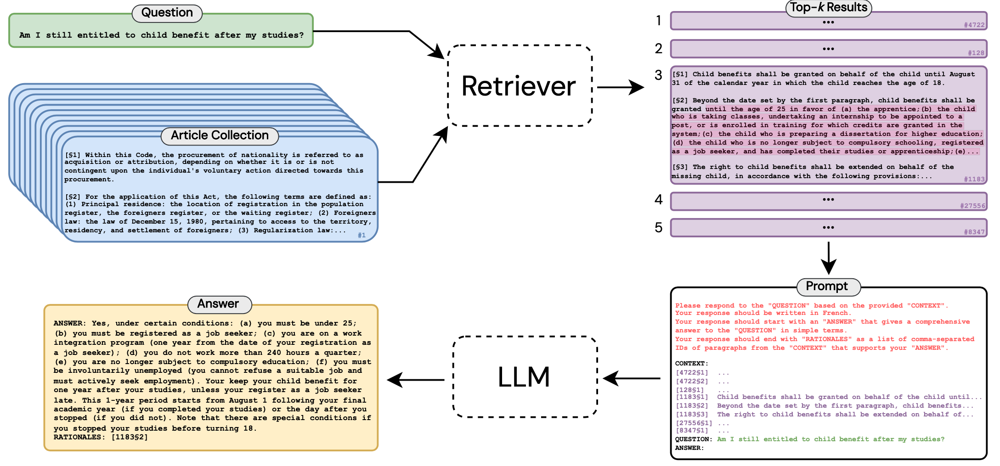

[](https://opensource.org/licenses/MIT)
[](https://www.python.org/downloads/)
[](https://arxiv.org/abs/)
[](https://huggingface.co/datasets/maastrichtlawtech/lleqa)

# Interpretable Long-form Legal Question Answering

This repository contains the code for reproducing the experimental results presented in the paper ["Interpretable Long-Form Legal Question Answering with Retrieval-Augmented Large Language Models"]() by [Antoine Louis](https:/antoinelouis.co/work/), [Gijs van Dijck](https://www.maastrichtuniversity.nl/gijs.vandijck), and [Jerry Spanakis](https://dke.maastrichtuniversity.nl/jerry.spanakis/).



Many individuals are likely to face a legal dispute at some point in their lives, but their lack of understanding of how to navigate these complex issues often renders them vulnerable. The advancement of natural language processing opens new avenues for bridging this legal literacy gap through the development of automated legal aid systems. However, existing legal question answering (LQA) approaches often suffer from a narrow scope, being either confined to specific legal domains or limited to brief, uninformative responses. In this work, we propose an end-to-end methodology designed to generate *long-form* answers to *any* statutory law questions, utilizing a "retrieve-then-read" pipeline. To support this approach, we introduce and release the Long-form Legal Question Answering (LLeQA) dataset, comprising 1,868 expert-annotated legal questions in the French language, complete with detailed answers rooted in pertinent legal provisions. Our experimental results demonstrate promising performance on automatic evaluation metrics, but a qualitative analysis uncovers areas for refinement. As one of the only comprehensive, expert-annotated long-form LQA dataset, LLeQA has the potential to not only accelerate research towards resolving a significant real-world issue, but also act as a rigorous benchmark for evaluating NLP models in specialized domains. We will release our data, models, and code to spur future work into long-form legal question answering.

## Documentation

Detailed documentation on the dataset and how to reproduce the main experimental results can be found [here](docs/README.md).

## Citation

For attribution in academic contexts, please cite this work as:

```latex
@article{louis2023interpretable,
  author = {Louis, Antoine and van Dijck, Gijs and Spanakis, Gerasimos},
  title = {Interpretable Long-Form Legal Question Answering with Retrieval-Augmented Large Language Models},
  journal = {CoRR},
  volume = {abs/2309.xxxxx},
  year = {2023},
  url = {https://doi.org/},
  doi = {},
  eprinttype = {arXiv},
  eprint = {2309.xxxxx},
}
```

## License

This repository is MIT-licensed.
